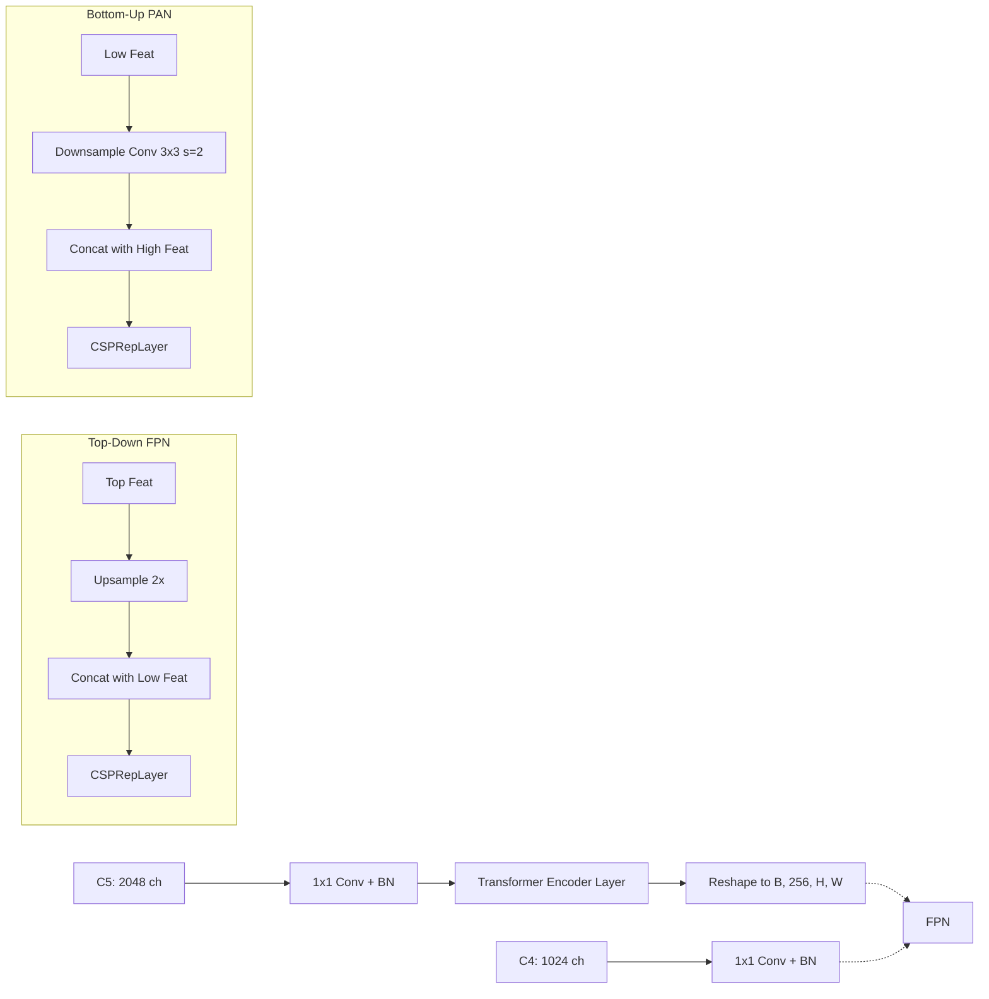
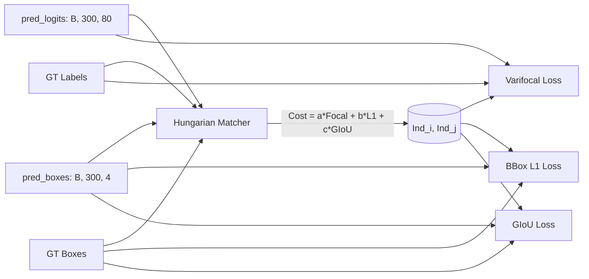

# RT-DETR Visual Diagrams

## 1. End-to-End Data Flow

```mermaid
flowchart TD
    %% Input
    Input[Input Image (B, 3, H, W)] --> Aug[Data Augmentation]
    Aug --> BB[Backbone: PResNet-50]
    
    %% Backbone
    BB -->|C3 (1/8)| C3[Feat C3 (B, 512, H/8, W/8)]
    BB -->|C4 (1/16)| C4[Feat C4 (B, 1024, H/16, W/16)]
    BB -->|C5 (1/32)| C5[Feat C5 (B, 2048, H/32, W/32)]
    
    %% Hybrid Encoder
    subgraph Hybrid Encoder
        C5 --> Proj[Input Proj & Transformer Encoder]
        Proj --> Enc5[Conv Proj (B, 256, H/32, W/32)]
        C4 --> Proj4[Conv Proj] --> Enc4[(B, 256, H/16, W/16)]
        C3 --> Proj3[Conv Proj] --> Enc3[(B, 256, H/8, W/8)]
        
        Enc5 -->|Upsample| FPN1[CCSPRep Layer]
        Enc4 --> FPN1
        FPN1 -->|Upsample| FPN2[CCSPRep Layer]
        Enc3 --> FPN2
        
        FPN2 -->|Downsample| PAN1[CCSPRep Layer]
        FPN1 --> PAN1
        PAN1 -->|Downsample| PAN2[CCSPRep Layer]
        Enc5 --> PAN2
    end
    
    FPN2 -->|F_out1| Dec[Transformer Decoder]
    PAN1 -->|F_out2| Dec
    PAN2 -->|F_out3| Dec
    
    %% Decoder & Head
    subgraph Transformer Decoder
        Dec --> MSDeformAttn[Multi-Scale Deformable Attention]
        Query[Object Queries] --> MSDeformAttn
        MSDeformAttn --> FFN[Feed Forward Network]
    end
    
    FFN --> Head[Detection Head]
    Head --> PredBoxes[Predicted Boxes]
    Head --> PredLogits[Predicted Class Logits]
    
    %% Loss Mode
    PredBoxes --> Matcher[Hungarian Matcher]
    PredLogits --> Matcher
    GT[Ground Truth] --> Matcher
    Matcher --> SetCrit[Set Criterion Loss]
    
    %% Inference Mode
    PredBoxes -.-> PostProc[Post Processor: Top-K]
    PredLogits -.-> PostProc
```

## 2. Hybrid Encoder Internal Structure



## 3. Decoder Iterative Refinement

```mermaid
flowchart TD
    Init[Encoder Output Anchor Initialization]
    Init -->|Sigmoid| Ref0[Reference Points 0]
    
    subgraph Layer 1
        Ref0 --> MA[Multi-Scale Deformable Attn]
        Feat[Multi-Scale Features] --> MA
        MA --> FFN[FFN]
        FFN --> BboxHead1[BBox Head]
        BboxHead1 -->|Add inv_sigmoid(Ref0)| Ref1_unact[Unactivated Ref]
        Ref1_unact -->|Sigmoid| Ref1[Reference Points 1]
    end
    
    subgraph Layer 2
        Ref1 --> MA2[Multi-Scale Deformable Attn]
        Feat --> MA2
        MA2 --> FFN2[FFN]
        FFN2 --> BboxHead2[BBox Head]
        BboxHead2 -->|Add inv_sigmoid(Ref1)| Ref2_unact[Unactivated Ref]
        Ref2_unact -->|Sigmoid| Ref2[Reference Points 2]
    end
    
    Ref2 -.-> LayerN[... Layers 3 to 6]
```

## 4. Matcher & Loss Flow


